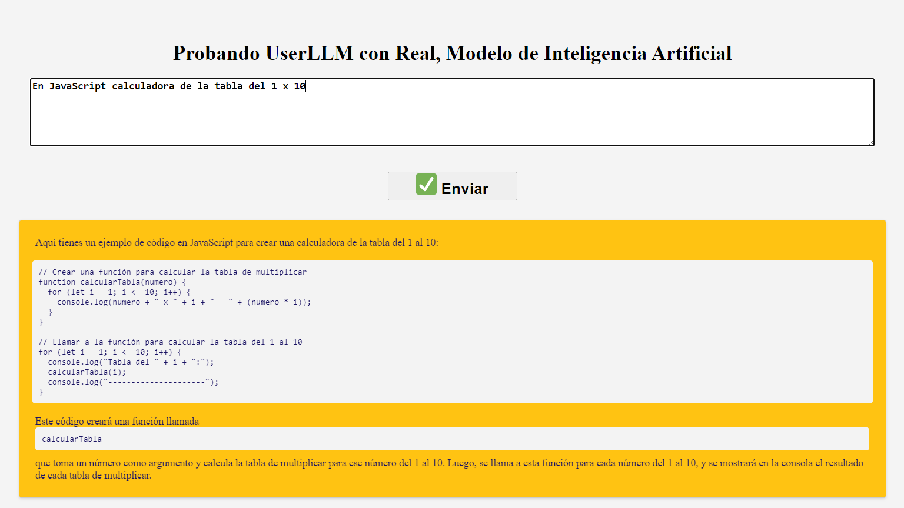
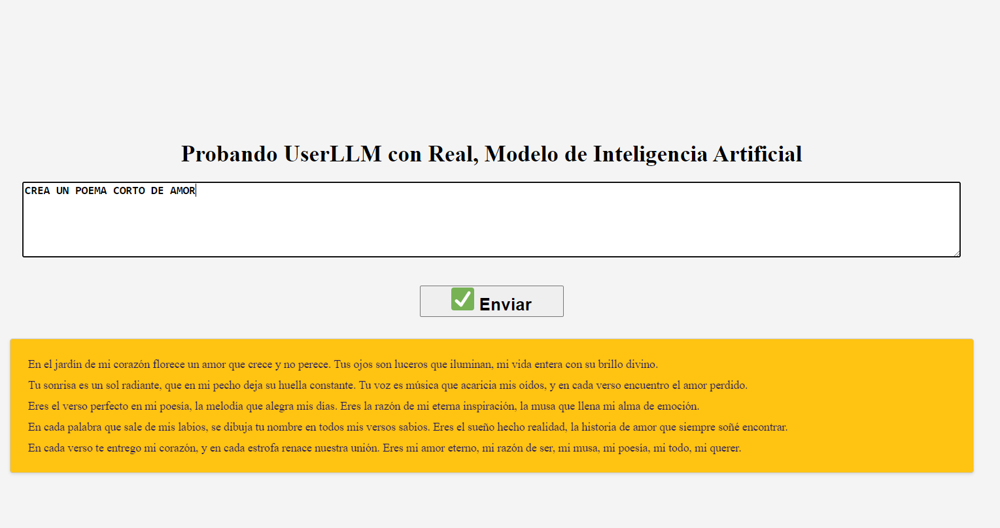
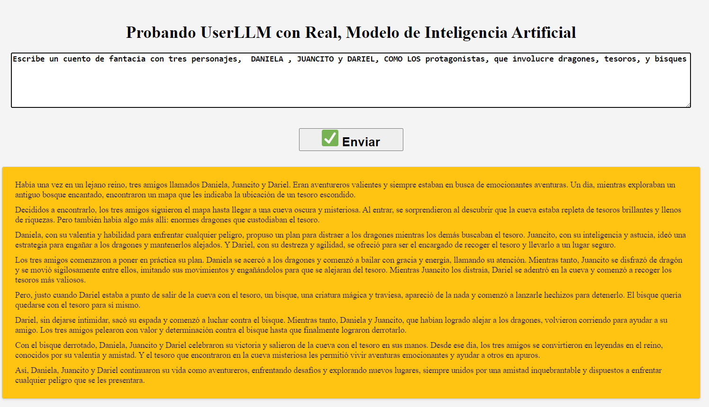
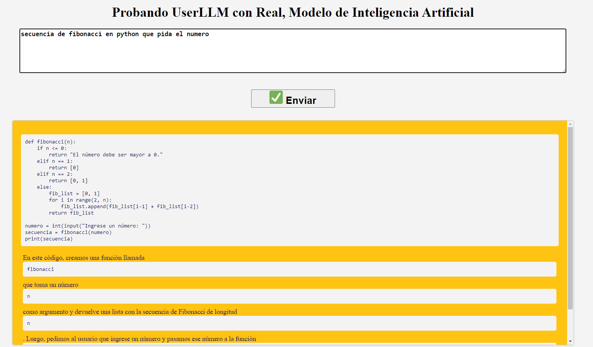

# USELLM_JPV
Probando UserLLM con Real, Modelo de Inteligencia Artificial con React, Hook, HTML, CSS, Netxjs,, etc.

## Descripcion del Proyecto: 
Este proyecto se trata de una demostración de uso de UserLLM con un modelo de inteligencia artificial. UserLLM es una librería que permite interactuar con modelos de lenguaje y tener conversaciones basadas en texto. En esta demo, se utiliza UserLLM para enviar mensajes ingresados por el usuario y recibir respuestas generadas por el modelo de inteligencia artificial.

El objetivo principal del proyecto es mostrar cómo se puede utilizar UserLLM para crear una interfaz de chat basada en texto, donde los usuarios pueden enviar mensajes y recibir respuestas generadas por el modelo de lenguaje.

El proyecto utiliza React como framework de desarrollo de frontend y se implementa la lógica de interacción con UserLLM en el componente principal Demo. Los mensajes ingresados por el usuario se envían a UserLLM para procesamiento y se muestra la respuesta generada en la interfaz.

El código también incluye funcionalidades adicionales, como formateo de respuestas según el tipo de contenido (texto o código) y estilos CSS para darle un aspecto visual agradable a la interfaz.

## En este proyecto, se abordan varios temas y conceptos relacionados con el desarrollo de aplicaciones web con React. Algunos de los temas tratados incluyen:

Importación de módulos: Se utiliza la declaración import para importar módulos y componentes necesarios en el proyecto. Esto permite utilizar librerías externas y funcionalidades adicionales en el código.

Eventos y manejo de eventos: Se utilizan eventos como onClick y onChange para detectar y manejar la interacción del usuario con la interfaz. Estos eventos permiten ejecutar funciones específicas cuando ocurren acciones como hacer clic en un botón o cambiar el valor de un campo de texto.

Formatos y estilos: Se aplican estilos y formatos a los elementos de la interfaz utilizando CSS y propiedades de estilo en línea. Esto incluye cambios en el tamaño de letra, color, alineación, formato de código, entre otros.

Uso de librerías externas: Se utiliza la librería useLLM para interactuar con el servicio de UserLLM y enviar mensajes al modelo de lenguaje. Además, se utiliza la librería react-syntax-highlighter para resaltar la sintaxis de bloques de código en la interfaz.

Estado y manejo de estado: Se utiliza el hook useState para manejar el estado de la aplicación y almacenar valores como la entrada del usuario y la respuesta generada por el modelo de lenguaje. El cambio de estado provoca la actualización de la interfaz.

Comunicación con APIs: Se realiza la comunicación con la API de UserLLM utilizando métodos y funciones proporcionados por la librería. Esto implica enviar mensajes a la API y recibir respuestas para su procesamiento y visualización en la interfaz.

## En este proyecto, se adquieren las siguientes habilidades y aptitudes:

Desarrollo con React: Aprenderás a utilizar el framework de React para construir la interfaz de usuario de la aplicación. Esto incluye la creación de componentes, el manejo de estados y eventos, y la gestión del flujo de datos.

Integración de APIs: Aprenderás a integrar una API externa, en este caso, la librería UserLLM, para comunicarte con un servicio de inteligencia artificial y realizar consultas y recibir respuestas.

Lógica de interacción con el modelo de lenguaje: Obtendrás experiencia en cómo enviar mensajes al modelo de lenguaje y recibir las respuestas generadas. Aprenderás a procesar y formatear las respuestas de acuerdo con tus necesidades.

Diseño de interfaz de usuario: Tendrás la oportunidad de diseñar y mejorar la interfaz de usuario de la aplicación, utilizando CSS y estilos personalizados para lograr una apariencia visual atractiva y una experiencia de usuario intuitiva.

Resolución de problemas técnicos: Durante el desarrollo del proyecto, es probable que te enfrentes a desafíos técnicos, como errores de programación o dificultades en la integración de la API. Aprenderás a investigar y solucionar problemas técnicos de manera efectiva.

Trabajo con modelos de lenguaje: Obtendrás experiencia en la interacción con modelos de lenguaje y comprensión de su funcionamiento. Esto incluye el manejo de respuestas generadas por el modelo y la adaptación de la información obtenida para su presentación al usuario.

### Configuración inicial del proyecto:

Crea una carpeta para tu proyecto y ábrela en tu entorno de desarrollo.

Inicializa un proyecto de React usando el siguiente comando en la terminal:

### npx create-react-app userllm-tutorial

Ingresa a la carpeta del proyecto:

### cd userllm-tutorial

Instalación de librerías:

Para interactuar con UserLLM, instala la librería usellm usando el siguiente comando:

### npm install usellm

Para resaltar la sintaxis de código, instala la librería react-syntax-highlighter:

### npm install react-syntax-highlighter

Estructura del proyecto:

Dentro de la carpeta del proyecto (src), crea un archivo llamado App.jsx para el componente principal.
Crea un archivo CSS llamado App.css para los estilos del componente.

Crea un archivo CSS adicional llamado index.css para los estilos generales de la aplicación.
Implementación del componente principal (App.jsx):

Copia y pega el código del componente App.jsx proporcionado anteriormente en el archivo App.jsx.
Importa las siguientes librerías en la parte superior del archivo App.jsx:

Asegúrate de tener las siguientes importaciones en la parte superior del archivo App.jsx:

### Estilos CSS:

Abre el archivo App.css y agrega los estilos necesarios según tus preferencias para darle formato a la interfaz.

Inicio de la aplicación:

Ejecuta el siguiente comando en la terminal para iniciar la aplicación en modo de desarrollo:

### pm start

La aplicación se abrirá automáticamente en tu navegador en la dirección http://localhost:5173.

### Imagenes del proyecto en Ejecucion:

### Prompt pidiendo que use el Lenguaje de Programacion Javascript para crear la tabla de multiplicar:

### Prompt pidiendo que cree un Poema de Amor, Generando Texto simple:

### Prompt pidiendo que escriba una historia de Fantasia, Generando Texto simple:

### Prompt pidiendo que use el Lenguaje de Programacion Python para crear la secuencia de fibonacci en python que pida el numero:

## Si te gusta este Articulo y Proyecto, no dudes en compatirlo en tus redes Sociales, ✔  No olvides suscribirte, compartir el video, darle like y dejar tus comentarios en la sección de abajo. ¡Tu apoyo es muy importante para mí  y me ayudas a seguir creando contenido. 💚

1-🎬 Youtube:https://www.youtube.com/@JuancitoPenaV 
2-👨‍💼 LinkedIn: https://www.linkedin.com/in/juancitope%C3%B1a/
3-📰 Blog: https://advisertecnology.com/
4-📷 Instagram: https://www.instagram.com/juancito.pena.v/
5-📑 Facebook:https://www.facebook.com/juancito.p.v
6-🐦 Twitter: https://twitter.com/JuancitoPenaV
